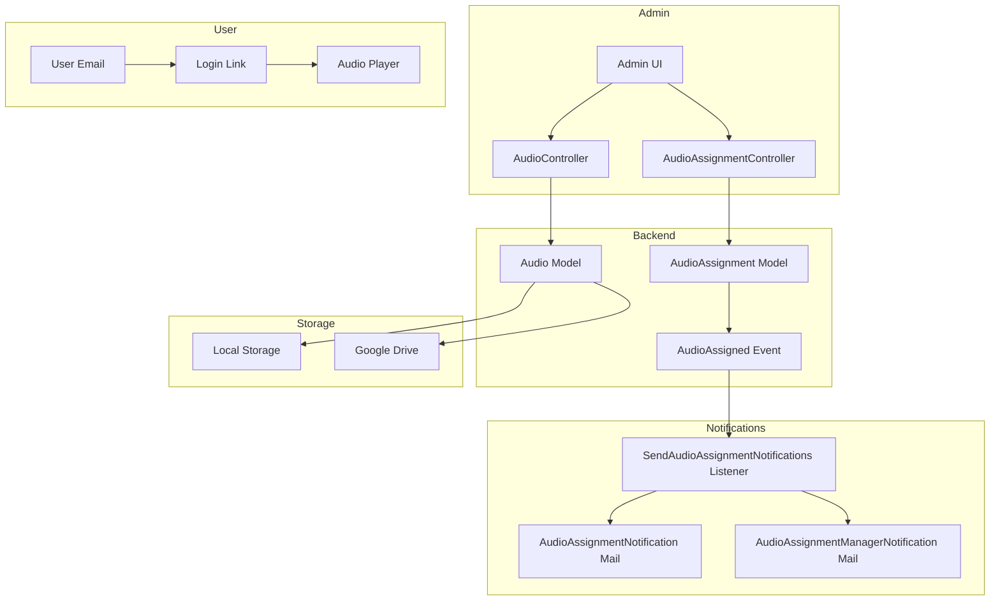

# Audio Assignment System - Design Document

## Overview

The Audio Assignment System extends the existing audio functionality to support user assignments with email notifications, mirroring the course online assignment pattern. The system allows admins to upload audio files to either Google Drive or local storage, assign them to users filtered by department, and automatically notify both users and their managers via email with direct access links.

## Architecture

The system follows Laravel's MVC architecture with event-driven notifications:



## Components and Interfaces

### 1. Database Schema

#### audio_assignments table
```php
Schema::create('audio_assignments', function (Blueprint $table) {
    $table->id();
    $table->foreignId('audio_id')->constrained('audios')->onDelete('cascade');
    $table->foreignId('user_id')->constrained('users')->onDelete('cascade');
    $table->foreignId('assigned_by')->constrained('users')->onDelete('cascade');
    $table->timestamp('assigned_at');
    $table->timestamp('started_at')->nullable();
    $table->timestamp('completed_at')->nullable();
    $table->enum('status', ['assigned', 'in_progress', 'completed'])->default('assigned');
    $table->decimal('progress_percentage', 5, 2)->default(0);
    $table->boolean('notification_sent')->default(false);
    $table->timestamps();
    
    $table->unique(['audio_id', 'user_id']);
    $table->index(['user_id', 'status']);
    $table->index('assigned_by');
});
```

#### audios table modification
```php
// Add storage_type and local_path columns
$table->enum('storage_type', ['google_drive', 'local'])->default('google_drive');
$table->string('local_path')->nullable();
```

### 2. Models

#### AudioAssignment Model
```php
class AudioAssignment extends Model
{
    protected $fillable = [
        'audio_id', 'user_id', 'assigned_by', 'assigned_at',
        'started_at', 'completed_at', 'status', 'progress_percentage',
        'notification_sent'
    ];
    
    // Relationships
    public function audio(): BelongsTo;
    public function user(): BelongsTo;
    public function assignedBy(): BelongsTo;
    
    // Methods
    public function markAsStarted(): void;
    public function updateProgress(float $percentage): void;
    public function markAsCompleted(): void;
}
```

### 3. Events

#### AudioAssigned Event
```php
class AudioAssigned
{
    public Audio $audio;
    public User $user;
    public User $assignedBy;
    public ?string $loginLink;
    public array $metadata;
}
```

### 4. Mail Classes

#### AudioAssignmentNotification
- Sends to assigned user
- Includes audio name, description, duration
- Contains tokenized login link button

#### AudioAssignmentManagerNotification
- Sends to user's manager(s)
- Includes team member name and audio details
- Skips self-managed users

### 5. Controllers

#### AudioAssignmentController
```php
class AudioAssignmentController extends Controller
{
    public function index();           // List assignments
    public function create();          // Show assignment form
    public function store(Request $request);  // Create assignments
    public function show($id);         // View assignment details
    public function getUsers(Request $request); // Filter users API
}
```

### 6. API Endpoints

| Method | Endpoint | Description |
|--------|----------|-------------|
| GET | /admin/audio-assignments | List all assignments |
| GET | /admin/audio-assignments/create | Assignment form |
| POST | /admin/audio-assignments | Create assignments |
| GET | /admin/audio-assignments/{id} | View assignment |
| GET | /api/users/filter | Filter users by department/name |
| GET | /audio/{id}/play | Play audio (with login token) |

## Data Models

### Audio (Extended)
```typescript
interface Audio {
    id: number;
    name: string;
    description: string | null;
    google_cloud_url: string | null;
    local_path: string | null;
    storage_type: 'google_drive' | 'local';
    duration: number | null;
    thumbnail_url: string | null;
    is_active: boolean;
    created_by: number;
    audio_category_id: number | null;
}
```

### AudioAssignment
```typescript
interface AudioAssignment {
    id: number;
    audio_id: number;
    user_id: number;
    assigned_by: number;
    assigned_at: string;
    started_at: string | null;
    completed_at: string | null;
    status: 'assigned' | 'in_progress' | 'completed';
    progress_percentage: number;
    notification_sent: boolean;
}
```

## Correctness Properties

*A property is a characteristic or behavior that should hold true across all valid executions of a system-essentially, a formal statement about what the system should do. Properties serve as the bridge between human-readable specifications and machine-verifiable correctness guarantees.*

### Property 1: Local storage file persistence
*For any* audio created with local storage type, the file at the recorded local_path should exist and be readable.
**Validates: Requirements 1.2**

### Property 2: Assignment creation completeness
*For any* assignment creation request with N selected users, exactly N AudioAssignment records should be created, each with assigned_by, assigned_at, and status='assigned' properly set.
**Validates: Requirements 2.4, 2.5**

### Property 3: User filter correctness
*For any* department filter or name search query, all returned users should match the filter criteria (belong to the department or have names containing the search term).
**Validates: Requirements 2.2, 2.3**

### Property 4: User notification email content
*For any* audio assignment, the user notification email should contain the audio name, description, duration, and a valid tokenized login link.
**Validates: Requirements 3.1, 3.2, 3.3**

### Property 5: Login link authentication round-trip
*For any* valid login token generated for an audio assignment, using that token should authenticate the user and provide access to the correct audio.
**Validates: Requirements 3.4**

### Property 6: Manager notification correctness
*For any* audio assignment where the user has a manager (who is not themselves), a manager notification email should be sent containing the team member's name and audio details.
**Validates: Requirements 4.1, 4.2, 4.3**

### Property 7: Self-manager notification skip
*For any* audio assignment where the user is their own manager, no manager notification email should be sent.
**Validates: Requirements 4.4**

### Property 8: Storage type player selection
*For any* audio, the player should load the correct source URL based on storage_type (google_drive_url for Google Drive, local streaming endpoint for local).
**Validates: Requirements 5.1**

### Property 9: Progress tracking persistence
*For any* audio playback progress update, the progress_percentage should be persisted and retrievable.
**Validates: Requirements 5.4**

### Property 10: Assignment status filter correctness
*For any* status filter on assignments, all returned assignments should have the matching status value.
**Validates: Requirements 6.2**

## Error Handling

| Scenario | Handling |
|----------|----------|
| Invalid audio file upload | Return validation error with message |
| Google Drive URL inaccessible | Return error, prevent save |
| Local storage write failure | Return error with storage details |
| User not found during assignment | Skip user, log warning, continue with others |
| Email send failure | Log error, mark notification_sent as false |
| Manager lookup failure | Log warning, skip manager notification |
| Invalid login token | Redirect to login page with error message |
| Audio file not found during playback | Return 404 with user-friendly message |

## Testing Strategy

### Property-Based Testing Library
The system will use **Pest PHP** with **pest-plugin-faker** for property-based testing, as it's already configured in the project.

### Unit Tests
- AudioAssignment model methods (markAsStarted, updateProgress, markAsCompleted)
- Audio storage type detection
- Login token generation and validation
- User filter query building

### Property-Based Tests
Each correctness property will be implemented as a property-based test:
- Tests will be tagged with format: `**Feature: audio-assignment-system, Property {number}: {property_text}**`
- Minimum 100 iterations per property test
- Smart generators for audio, user, and assignment data

### Integration Tests
- Full assignment flow (create → notify → access)
- Email delivery verification
- Storage type switching
- Manager hierarchy notification chain

### Test File Structure
```
tests/
├── Feature/
│   └── AudioAssignment/
│       ├── AudioAssignmentCreationTest.php
│       ├── AudioAssignmentNotificationTest.php
│       └── AudioAssignmentFilterTest.php
└── Unit/
    └── AudioAssignment/
        ├── AudioAssignmentModelTest.php
        └── AudioStorageTest.php
```
