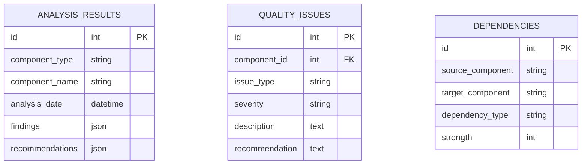

# Design Document: Project Analysis & Documentation

## Overview

This design document outlines the comprehensive approach for analyzing the NVT Courses LMS to understand its current state, identify improvement opportunities, and provide professional documentation for management decision-making. The analysis will be conducted systematically across multiple dimensions to ensure complete understanding of the system.

### Analysis Objectives

**Primary Goals:**
1. **Complete System Understanding** - Document every component and its purpose
2. **Quality Assessment** - Identify technical debt and improvement opportunities  
3. **Strategic Options** - Research and compare different restructuring approaches
4. **Risk Analysis** - Understand the implications of various improvement strategies
5. **Management Communication** - Provide clear, actionable recommendations

**Deliverables:**
- Comprehensive technical documentation
- Executive summary and presentations
- Risk assessment and ROI analysis
- Restructuring options comparison
- Implementation roadmap recommendations

## Architecture

### Analysis Framework

The analysis will follow a structured approach across six key dimensions:

```
Analysis Dimensions:
├── Technical Analysis
│   ├── System Inventory
│   ├── Architecture Assessment
│   ├── Code Quality Review
│   └── Performance Analysis
│
├── Business Analysis
│   ├── Domain Modeling
│   ├── Process Mapping
│   ├── User Experience Review
│   └── Data Flow Analysis
│
├── Security & Compliance
│   ├── Security Assessment
│   ├── Vulnerability Analysis
│   └── Compliance Review
│
├── Strategic Analysis
│   ├── Restructuring Options
│   ├── Technology Assessment
│   └── Future Scalability
│
├── Risk & Impact Analysis
│   ├── Change Impact Assessment
│   ├── Risk Identification
│   └── Mitigation Strategies
│
└── Communication & Planning
    ├── Executive Materials
    ├── Technical Documentation
    └── Implementation Planning
```

### Documentation Structure

All analysis results will be organized in a consistent structure:

```
docs/
├── executive-summary/
│   ├── key-findings.md
│   ├── recommendations.md
│   └── presentations/
│
├── technical-analysis/
│   ├── system-inventory/
│   ├── architecture/
│   ├── code-quality/
│   └── performance/
│
├── business-analysis/
│   ├── domain-model/
│   ├── process-flows/
│   └── user-experience/
│
├── security-analysis/
│   ├── vulnerability-assessment.md
│   └── compliance-review.md
│
├── strategic-options/
│   ├── restructuring-approaches/
│   ├── technology-options/
│   └── comparison-matrix.md
│
├── risk-assessment/
│   ├── impact-analysis.md
│   ├── risk-register.md
│   └── mitigation-plans.md
│
└── implementation-planning/
    ├── roadmap-options/
    ├── effort-estimates/
    └── success-metrics/
```

## Components and Interfaces

### Analysis Tools and Methods

**Automated Analysis Tools:**
- **PHPStan/Larastan** - Static code analysis for PHP
- **ESLint** - JavaScript/Vue code quality analysis
- **Laravel Debugbar** - Performance and query analysis
- **Composer Audit** - Security vulnerability scanning
- **NPM Audit** - Frontend dependency security
- **Custom Scripts** - File counting, dependency mapping

**Manual Analysis Methods:**
- **Code Review** - Pattern identification and quality assessment
- **Architecture Review** - Structure and design pattern analysis
- **Business Process Mapping** - Workflow documentation
- **User Journey Analysis** - UX and usability assessment

### System Inventory Components

**Backend Inventory:**
```php
// Example inventory structure
[
    'models' => [
        'User' => [
            'table' => 'users',
            'relationships' => ['courses', 'departments', 'evaluations'],
            'business_purpose' => 'User management and authentication',
            'complexity_score' => 8,
            'dependencies' => ['Department', 'UserLevel']
        ],
        // ... all other models
    ],
    'controllers' => [
        'UserController' => [
            'routes' => ['/users', '/users/{user}'],
            'methods' => ['index', 'show', 'store', 'update'],
            'responsibilities' => ['User CRUD', 'User assignment'],
            'dependencies' => ['UserService', 'ManagerHierarchyService']
        ],
        // ... all other controllers
    ]
]
```

**Frontend Inventory:**
```javascript
// Example Vue page inventory
{
  "pages": {
    "Admin/Users/Index.vue": {
      "route": "/admin/users",
      "purpose": "User management dashboard",
      "components_used": ["DataTable", "UserForm", "Modal"],
      "api_endpoints": ["/api/users", "/api/departments"],
      "complexity_score": 6
    }
    // ... all other pages
  }
}
```

## Data Models

### Analysis Data Structure

The analysis will produce structured data that can be queried and visualized:

**System Component Model:**
```php
class SystemComponent
{
    public string $type; // 'model', 'controller', 'service', 'vue_page'
    public string $name;
    public string $path;
    public array $dependencies;
    public array $dependents;
    public int $complexity_score;
    public array $issues;
    public string $business_domain;
}
```

**Business Domain Model:**
```php
class BusinessDomain
{
    public string $name;
    public string $description;
    public array $models;
    public array $controllers;
    public array $services;
    public array $vue_pages;
    public float $cohesion_score;
    public array $external_dependencies;
}
```

**Quality Issue Model:**
```php
class QualityIssue
{
    public string $type; // 'duplication', 'naming', 'performance', 'security'
    public string $severity; // 'low', 'medium', 'high', 'critical'
    public string $component;
    public string $description;
    public string $recommendation;
    public int $effort_estimate;
}
```

### Database Schema Analysis

The analysis will document the complete database structure:



## Correctness Properties

*A property is a characteristic or behavior that should hold true across all valid executions of a system-essentially, a formal statement about what the system should do. Properties serve as the bridge between human-readable specifications and machine-verifiable correctness guarantees.*

### Property 1: System Inventory Completeness
*For any* model file in `app/Models/`, the system inventory documentation SHALL contain an entry with table name, relationships, and business purpose.
**Validates: Requirements 1.1**

### Property 2: Controller Documentation Completeness  
*For any* controller file in `app/Http/Controllers/`, the controller catalog SHALL contain an entry with routes, methods, and responsibilities.
**Validates: Requirements 1.2**

### Property 3: Service Inventory Completeness
*For any* service file in `app/Services/`, the service inventory SHALL contain an entry with purpose and dependencies.
**Validates: Requirements 1.3**

### Property 4: Vue Page Documentation Completeness
*For any* Vue page file in `resources/js/pages/`, the page inventory SHALL contain an entry with route and functionality description.
**Validates: Requirements 1.4**

### Property 5: Database Documentation Completeness
*For any* migration file in `database/migrations/`, the database documentation SHALL contain corresponding table and relationship information.
**Validates: Requirements 1.6**

### Property 6: Domain Component Mapping Completeness
*For any* identified business domain, the domain mapping SHALL include all models, controllers, and services that belong to that domain.
**Validates: Requirements 3.2**

### Property 7: Dependency Documentation Completeness
*For any* Composer package in `composer.json`, the dependency analysis SHALL contain version, purpose, and security assessment.
**Validates: Requirements 7.1**

### Property 8: Test Coverage Documentation Accuracy
*For any* critical code path identified, the test coverage report SHALL accurately reflect whether that path has test coverage.
**Validates: Requirements 4.5**

### Property 9: Documentation Standards Consistency
*For any* analysis document created, the document SHALL follow the established formatting and structure standards.
**Validates: Requirements 13.1**

## Error Handling

### Analysis Error Management

**Data Collection Errors:**
```php
class AnalysisException extends Exception
{
    public function __construct(
        string $component,
        string $analysisType,
        string $error,
        ?Throwable $previous = null
    ) {
        $message = "Analysis failed for {$component} during {$analysisType}: {$error}";
        parent::__construct($message, 0, $previous);
    }
}

// Usage in analysis scripts
try {
    $modelAnalysis = $this->analyzeModel($modelPath);
} catch (AnalysisException $e) {
    Log::warning("Model analysis failed", [
        'component' => $e->getComponent(),
        'type' => $e->getAnalysisType(),
        'error' => $e->getMessage()
    ]);
    
    // Continue with partial analysis
    $modelAnalysis = $this->getPartialAnalysis($modelPath);
}
```

**Missing File Handling:**
```php
class FileAnalyzer
{
    public function analyzeFile(string $path): array
    {
        if (!file_exists($path)) {
            return [
                'status' => 'missing',
                'error' => "File not found: {$path}",
                'analysis' => null
            ];
        }
        
        try {
            return [
                'status' => 'success',
                'analysis' => $this->performAnalysis($path)
            ];
        } catch (Exception $e) {
            return [
                'status' => 'error',
                'error' => $e->getMessage(),
                'analysis' => $this->getBasicInfo($path)
            ];
        }
    }
}
```

## Testing Strategy

### Analysis Verification Approach

**Documentation Completeness Tests:**
- Verify all system components are documented
- Check that documentation follows standards
- Validate cross-references and links

**Data Accuracy Tests:**
- Compare inventory against actual files
- Verify dependency mappings are correct
- Check that metrics calculations are accurate

**Report Quality Tests:**
- Ensure all required sections are present
- Verify visual diagrams are generated
- Check that recommendations are actionable

### Testing Framework for Analysis

```php
// Example test for inventory completeness
class SystemInventoryTest extends TestCase
{
    public function test_all_models_are_documented(): void
    {
        $actualModels = $this->getActualModels();
        $documentedModels = $this->getDocumentedModels();
        
        $missing = array_diff($actualModels, $documentedModels);
        
        $this->assertEmpty($missing, 
            'Missing model documentation: ' . implode(', ', $missing)
        );
    }
    
    public function test_all_controllers_have_route_documentation(): void
    {
        $controllers = $this->getControllerInventory();
        
        foreach ($controllers as $controller) {
            $this->assertNotEmpty($controller['routes'], 
                "Controller {$controller['name']} missing route documentation"
            );
        }
    }
}
```

## Analysis Methodology

### Phase 1: Automated Data Collection

**System Scanning:**
```bash
# Automated inventory collection
php artisan analyze:models --output=docs/inventory/models.json
php artisan analyze:controllers --output=docs/inventory/controllers.json
php artisan analyze:services --output=docs/inventory/services.json
npm run analyze:vue-pages --output=docs/inventory/vue-pages.json
```

**Code Quality Analysis:**
```bash
# Static analysis
vendor/bin/phpstan analyse --level=5 --format=json > docs/quality/phpstan-report.json
npx eslint resources/js --format=json > docs/quality/eslint-report.json

# Security scanning
composer audit --format=json > docs/security/composer-audit.json
npm audit --json > docs/security/npm-audit.json
```

### Phase 2: Manual Analysis and Review

**Architecture Review Process:**
1. **System Structure Analysis** - Review directory organization and file relationships
2. **Design Pattern Assessment** - Identify MVC adherence and pattern usage
3. **Business Logic Review** - Understand domain boundaries and responsibilities
4. **Integration Analysis** - Document external dependencies and APIs

**Code Quality Review Process:**
1. **Naming Convention Analysis** - Check consistency across the codebase
2. **Duplication Detection** - Identify repeated code patterns
3. **Error Handling Review** - Assess exception handling patterns
4. **Performance Review** - Identify potential bottlenecks

### Phase 3: Strategic Analysis

**Restructuring Options Research:**
1. **Modular Monolith** - Analyze benefits for domain separation
2. **Microservices** - Assess feasibility and complexity
3. **Clean Architecture** - Evaluate dependency inversion opportunities
4. **Domain-Driven Design** - Analyze domain modeling potential

**Risk and Impact Assessment:**
1. **Change Impact Analysis** - Identify affected components for each approach
2. **Migration Complexity** - Estimate effort and timeline for each option
3. **Team Capability Assessment** - Evaluate team readiness for each approach
4. **Business Continuity** - Assess risks to ongoing operations

### Phase 4: Documentation and Communication

**Technical Documentation:**
- Detailed analysis reports with code examples
- Architecture diagrams and dependency maps
- Quality metrics and improvement recommendations
- Implementation guides and best practices

**Management Communication:**
- Executive summary with key findings
- Visual presentations with clear recommendations
- ROI analysis and business case development
- Timeline and resource requirement estimates

## Deliverable Templates

### Executive Summary Template

```markdown
# Project Analysis Executive Summary

## Key Findings
- **System Complexity**: [High/Medium/Low] with [X] interconnected components
- **Technical Debt**: [X] critical issues identified requiring immediate attention
- **Scalability**: Current architecture [can/cannot] support [X]% growth
- **Security**: [X] vulnerabilities found, [X] require immediate action

## Recommended Approach
**Primary Recommendation**: [Modular Monolith/Microservices/Clean Architecture]
- **Timeline**: [X] months for complete implementation
- **Effort**: [X] developer-months
- **Risk Level**: [Low/Medium/High]
- **ROI**: [X]% improvement in maintainability, [X]% reduction in bug rate

## Next Steps
1. [Immediate action required]
2. [Short-term improvements (1-3 months)]
3. [Long-term restructuring (3-12 months)]
```

### Technical Analysis Template

```markdown
# [Component] Analysis Report

## Overview
- **Component Type**: [Model/Controller/Service/Vue Page]
- **Business Domain**: [User Management/Course Management/etc.]
- **Complexity Score**: [1-10]
- **Quality Score**: [1-10]

## Current Implementation
[Detailed description of how the component currently works]

## Issues Identified
1. **[Issue Type]**: [Description]
   - **Severity**: [Low/Medium/High/Critical]
   - **Impact**: [Description of impact]
   - **Recommendation**: [Specific action to take]

## Dependencies
- **Depends On**: [List of dependencies]
- **Used By**: [List of dependents]
- **External Dependencies**: [Third-party services/packages]

## Improvement Recommendations
1. **Short-term** (1-4 weeks): [Quick fixes]
2. **Medium-term** (1-3 months): [Structural improvements]
3. **Long-term** (3+ months): [Major refactoring]
```

This comprehensive analysis approach will provide you and your manager with complete understanding of the current system and clear, actionable recommendations for improvement.