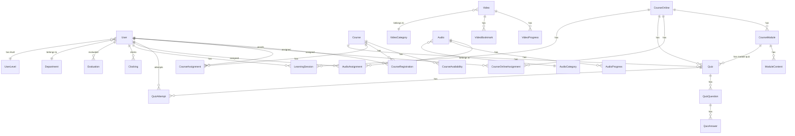

# Design Document: Project Restructure to Modular Architecture

## Overview

This design document outlines the technical approach for restructuring the NVT Courses LMS from a monolithic Laravel application to a modular, domain-driven architecture while upgrading to Laravel 12. The restructuring will be performed incrementally with zero data loss, maintaining full backward compatibility throughout the transition.

### Current State Analysis

**Backend (Laravel 11):**
- 45 Eloquent Models in `app/Models/`
- 60+ Controllers across `app/Http/Controllers/` (Admin, User, Api, Auth, Settings)
- 32 Services in `app/Services/`
- 15 Mail classes in `app/Mail/`
- 12 Events and 6 Listeners
- 6 Route files (web.php, admin.php, auth.php, channels.php, console.php, settings.php)

**Frontend (Vue 3 + Inertia.js):**
- 100+ Vue pages in `resources/js/pages/`
- 30+ UI components in `resources/js/components/ui/`
- 4 Layouts (AdminLayout, AppLayout, AttendanceLayout, AuthLayout)
- 3 Composables

**Key Issues Identified:**
1. Inconsistent naming (CourseOnline vs OnlineCourse)
2. Duplicate route definitions in web.php and admin.php
3. Large controllers with mixed responsibilities
4. Services with overlapping functionality
5. No clear domain boundaries
6. Missing test coverage

## Architecture

### Target Modular Structure

```
app/
├── Modules/
│   ├── User/
│   │   ├── Models/
│   │   ├── Http/Controllers/
│   │   ├── Services/
│   │   ├── Events/
│   │   ├── Listeners/
│   │   ├── Mail/
│   │   ├── Routes/
│   │   └── Providers/UserServiceProvider.php
│   │
│   ├── TraditionalCourse/
│   │   ├── Models/
│   │   ├── Http/Controllers/
│   │   ├── Services/
│   │   ├── Events/
│   │   ├── Listeners/
│   │   ├── Mail/
│   │   ├── Routes/
│   │   └── Providers/TraditionalCourseServiceProvider.php
│   │
│   ├── OnlineCourse/
│   │   ├── Models/
│   │   ├── Http/Controllers/
│   │   ├── Services/
│   │   ├── Events/
│   │   ├── Listeners/
│   │   ├── Mail/
│   │   ├── Routes/
│   │   └── Providers/OnlineCourseServiceProvider.php
│   │
│   ├── Quiz/
│   │   ├── Models/
│   │   ├── Http/Controllers/
│   │   ├── Services/
│   │   ├── Routes/
│   │   └── Providers/QuizServiceProvider.php
│   │
│   ├── Audio/
│   │   ├── Models/
│   │   ├── Http/Controllers/
│   │   ├── Services/
│   │   ├── Events/
│   │   ├── Listeners/
│   │   ├── Mail/
│   │   ├── Routes/
│   │   └── Providers/AudioServiceProvider.php
│   │
│   ├── Video/
│   │   ├── Models/
│   │   ├── Http/Controllers/
│   │   ├── Services/
│   │   ├── Routes/
│   │   └── Providers/VideoServiceProvider.php
│   │
│   ├── Attendance/
│   │   ├── Models/
│   │   ├── Http/Controllers/
│   │   ├── Services/
│   │   ├── Routes/
│   │   └── Providers/AttendanceServiceProvider.php
│   │
│   ├── Evaluation/
│   │   ├── Models/
│   │   ├── Http/Controllers/
│   │   ├── Services/
│   │   ├── Mail/
│   │   ├── Routes/
│   │   └── Providers/EvaluationServiceProvider.php
│   │
│   ├── Notification/
│   │   ├── Models/
│   │   ├── Services/
│   │   ├── Events/
│   │   ├── Listeners/
│   │   ├── Mail/
│   │   └── Providers/NotificationServiceProvider.php
│   │
│   └── Reporting/
│       ├── Models/
│       ├── Http/Controllers/
│       ├── Services/
│       ├── Routes/
│       └── Providers/ReportingServiceProvider.php
│
├── Shared/
│   ├── Models/BaseModel.php
│   ├── Http/Controllers/BaseController.php
│   ├── Services/
│   │   ├── FileUploadService.php
│   │   ├── ThumbnailService.php
│   │   └── ExportService.php
│   ├── Middleware/
│   ├── Requests/
│   └── Traits/
│
└── Legacy/  (temporary during migration)
    ├── Models/
    ├── Controllers/
    └── Services/
```

### Frontend Modular Structure

```
resources/js/
├── modules/
│   ├── user/
│   │   ├── pages/
│   │   ├── components/
│   │   └── composables/
│   │
│   ├── traditional-course/
│   │   ├── pages/
│   │   ├── components/
│   │   └── composables/
│   │
│   ├── online-course/
│   │   ├── pages/
│   │   ├── components/
│   │   └── composables/
│   │
│   ├── quiz/
│   │   ├── pages/
│   │   ├── components/
│   │   └── composables/
│   │
│   ├── audio/
│   │   ├── pages/
│   │   ├── components/
│   │   └── composables/
│   │
│   ├── video/
│   │   ├── pages/
│   │   ├── components/
│   │   └── composables/
│   │
│   ├── attendance/
│   │   ├── pages/
│   │   ├── components/
│   │   └── composables/
│   │
│   ├── evaluation/
│   │   ├── pages/
│   │   ├── components/
│   │   └── composables/
│   │
│   └── reporting/
│       ├── pages/
│       ├── components/
│       └── composables/
│
├── shared/
│   ├── components/
│   │   └── ui/  (existing shadcn components)
│   ├── composables/
│   ├── types/
│   └── utils/
│
├── layouts/
└── pages/  (legacy, gradually migrated)
```

## Components and Interfaces

### Module Service Provider Interface

Each module will have a service provider that registers:
- Models
- Controllers
- Routes
- Events/Listeners
- Services

```php
// app/Modules/User/Providers/UserServiceProvider.php
namespace App\Modules\User\Providers;

use Illuminate\Support\ServiceProvider;

class UserServiceProvider extends ServiceProvider
{
    public function register(): void
    {
        // Register module services
        $this->app->singleton(
            \App\Modules\User\Services\ManagerHierarchyService::class
        );
    }

    public function boot(): void
    {
        // Load routes
        $this->loadRoutesFrom(__DIR__.'/../Routes/web.php');
        $this->loadRoutesFrom(__DIR__.'/../Routes/admin.php');
        
        // Register event listeners
        $this->registerEventListeners();
    }
}
```

### Cross-Module Communication Interface

Modules communicate through well-defined interfaces:

```php
// app/Modules/User/Contracts/UserRepositoryInterface.php
namespace App\Modules\User\Contracts;

interface UserRepositoryInterface
{
    public function findById(int $id): ?User;
    public function findByEmail(string $email): ?User;
    public function getUsersInDepartment(int $departmentId): Collection;
    public function getDirectReports(int $managerId): Collection;
}
```

### Module Component Mapping

| Module | Models | Controllers | Services |
|--------|--------|-------------|----------|
| User | User, Department, UserLevel, UserLevelTier, UserDepartmentRole | UserController, UserDepartmentRoleController, OrganizationalController | ManagerHierarchyService |
| TraditionalCourse | Course, CourseAvailability, CourseRegistration, CourseCompletion, CourseAssignment | CourseController, CourseAssignmentController | CourseService |
| OnlineCourse | CourseOnline, CourseModule, ModuleContent, CourseOnlineAssignment, UserContentProgress, LearningSession | CourseOnlineController, CourseModuleController, ModuleContentController, ContentViewController | CourseProgressService, CourseAnalyticsService, SessionAnalyticsService, ProgressCalculationService |
| Quiz | Quiz, QuizQuestion, QuizAnswer, QuizAttempt, QuizAssignment, ModuleQuizResult | QuizController, QuizAssignmentController, ModuleQuizController | - |
| Audio | Audio, AudioCategory, AudioProgress, AudioAssignment | AudioController, AudioAssignmentController, AudioCategoryController | - |
| Video | Video, VideoCategory, VideoProgress, VideoBookmark, VideoQuality | VideoController, VideoStreamController, VideoCategoryController | VideoStorageService, VpsTranscodingService, GoogleDriveService |
| Attendance | Clocking | ClockingController, AttendanceController | AttendanceService, ClockingService |
| Evaluation | Evaluation, EvaluationConfig, EvaluationType, EvaluationHistory, Incentive | EvaluationController, UserEvaluationController, OnlineCourseEvaluationController | EvaluationEmailService |
| Notification | NotificationTemplate | - | NotificationService, EmailService |
| Reporting | CourseAnalytics, ActivityLog | ReportController, CourseOnlineReportController, UserCourseProgressReportController, AnalyticsController | ReportService, ExportAnalyticsService, CsvExportService, ExcelExportService, MonthlyKpiService, DepartmentPerformanceService, LearningScoreCalculator |

## Data Models

### Database Schema Preservation Strategy

The existing database schema will be preserved. No tables or columns will be removed. New module organization will use:

1. **Model Aliasing**: Models moved to modules will maintain original table names
2. **Database Views**: For complex cross-module queries
3. **Additive Migrations**: Only add new columns/tables, never remove

```php
// Example: Model in new location maintaining original table
namespace App\Modules\User\Models;

use App\Shared\Models\BaseModel;

class User extends BaseModel
{
    protected $table = 'users';  // Explicit table name
    
    // All existing relationships preserved
    public function department()
    {
        return $this->belongsTo(Department::class);
    }
    
    // ... all other relationships
}
```

### Entity Relationship Diagram (Key Relationships)



## Correctness Properties

*A property is a characteristic or behavior that should hold true across all valid executions of a system-essentially, a formal statement about what the system should do. Properties serve as the bridge between human-readable specifications and machine-verifiable correctness guarantees.*

### Property 1: Model Inventory Completeness
*For any* model file in `app/Models/`, the system analyzer documentation SHALL contain an entry describing that model's relationships and responsibilities.
**Validates: Requirements 1.1**

### Property 2: Controller Documentation Completeness
*For any* controller file in `app/Http/Controllers/`, the system analyzer documentation SHALL contain an entry listing all routes and methods for that controller.
**Validates: Requirements 1.2**

### Property 3: Service Catalog Completeness
*For any* service file in `app/Services/`, the service catalog SHALL contain an entry describing that service's purpose.
**Validates: Requirements 1.3**

### Property 4: Vue Page Mapping Completeness
*For any* Vue page file in `resources/js/pages/`, the page mapping documentation SHALL contain an entry for that page.
**Validates: Requirements 1.4**

### Property 5: Module Structure Verification
*For any* defined module, all specified models, controllers, and services SHALL exist in the correct module directory structure.
**Validates: Requirements 3.1-12.5**

### Property 6: Shared Kernel Component Existence
*For any* component specified in the shared kernel requirements (base classes, utility services, middleware), that component SHALL exist in the `app/Shared/` directory.
**Validates: Requirements 13.1-13.5**

### Property 7: Route Organization by Module
*For any* module, there SHALL exist a dedicated route file in that module's Routes directory containing all routes for that module.
**Validates: Requirements 17.1**

### Property 8: URL Naming Consistency
*For any* route in the system, the URL pattern SHALL follow the established naming convention: `/{module}/{resource}/{action}` for admin routes and `/{resource}/{action}` for user routes.
**Validates: Requirements 17.2**

### Property 9: No Duplicate Routes
*For any* URL pattern in the system, there SHALL be exactly one route definition (no duplicates across route files).
**Validates: Requirements 17.4**

### Property 10: Backward Compatible URLs
*For any* URL that existed before restructuring, that URL SHALL continue to return the same response after restructuring.
**Validates: Requirements 17.5**

### Property 11: Data Preservation - Record Counts
*For any* database table, the record count before migration SHALL equal the record count after migration.
**Validates: Requirements 19.1**

### Property 12: Additive-Only Migrations
*For any* migration file created during restructuring, the migration SHALL NOT contain DROP TABLE, DROP COLUMN, or destructive ALTER statements.
**Validates: Requirements 19.2**

### Property 13: Foreign Key Preservation
*For any* foreign key constraint that existed before restructuring, that constraint SHALL exist after restructuring.
**Validates: Requirements 19.3**

### Property 14: No Destructive Renames
*For any* migration file, there SHALL be no RENAME TABLE or RENAME COLUMN statements; instead, new structures with data copy SHALL be used.
**Validates: Requirements 19.4**

### Property 15: Rollback Migration Existence
*For any* migration file created during restructuring, there SHALL exist a corresponding down() method that reverses the migration without data loss.
**Validates: Requirements 19.8**

### Property 16: Laravel Version Verification
*For the* composer.json file, the Laravel framework version SHALL be 12.x after upgrade.
**Validates: Requirements 20.1**

### Property 17: Test Suite Passes After Upgrade
*For the* complete test suite, all tests SHALL pass after Laravel 12 upgrade.
**Validates: Requirements 20.10**

### Property 18: Frontend Module Organization
*For any* Vue page that belongs to a specific domain, that page SHALL be located in the corresponding module directory under `resources/js/modules/`.
**Validates: Requirements 16.1**

## Error Handling

### Migration Error Handling Strategy

```php
// Example migration with error handling and rollback
class MoveUserModelsToModule extends Migration
{
    public function up(): void
    {
        DB::beginTransaction();
        
        try {
            // Create backup marker
            $this->createBackupMarker();
            
            // Verify source data
            $this->verifySourceData();
            
            // Perform migration steps
            $this->performMigration();
            
            // Verify data integrity
            $this->verifyDataIntegrity();
            
            DB::commit();
            
            // Log success
            $this->logMigrationSuccess();
            
        } catch (\Exception $e) {
            DB::rollBack();
            $this->logMigrationFailure($e);
            throw $e;
        }
    }
    
    private function verifyDataIntegrity(): void
    {
        // Compare record counts
        // Verify foreign key relationships
        // Check data checksums
    }
}
```

### Module Loading Error Handling

```php
// ModuleServiceProvider with graceful degradation
class ModuleServiceProvider extends ServiceProvider
{
    public function boot(): void
    {
        foreach ($this->getModules() as $module) {
            try {
                $this->loadModule($module);
            } catch (ModuleLoadException $e) {
                Log::error("Failed to load module: {$module}", [
                    'error' => $e->getMessage()
                ]);
                
                // Fall back to legacy implementation
                $this->loadLegacyFallback($module);
            }
        }
    }
}
```

## Testing Strategy

### Dual Testing Approach

The restructuring will use both unit tests and property-based tests:

**Unit Tests:**
- Test specific module functionality
- Test controller responses
- Test service methods
- Test model relationships

**Property-Based Tests:**
- Verify data preservation properties
- Verify migration safety properties
- Verify URL backward compatibility
- Verify module structure completeness

### Testing Framework

- **PHP Testing**: Pest PHP (already configured)
- **Property-Based Testing**: Use Pest with custom generators
- **Frontend Testing**: Vitest for Vue components
- **E2E Testing**: Playwright (existing setup in tests-e2e/)

### Test Organization by Module

```
tests/
├── Unit/
│   ├── Modules/
│   │   ├── User/
│   │   │   ├── UserServiceTest.php
│   │   │   └── ManagerHierarchyServiceTest.php
│   │   ├── OnlineCourse/
│   │   │   ├── CourseProgressServiceTest.php
│   │   │   └── SessionAnalyticsServiceTest.php
│   │   └── ...
│   └── Shared/
│       └── FileUploadServiceTest.php
│
├── Feature/
│   ├── Modules/
│   │   ├── User/
│   │   │   ├── UserControllerTest.php
│   │   │   └── UserDepartmentRoleTest.php
│   │   └── ...
│   └── Migration/
│       ├── DataPreservationTest.php
│       └── BackwardCompatibilityTest.php
│
├── Property/
│   ├── DataPreservationPropertyTest.php
│   ├── MigrationSafetyPropertyTest.php
│   ├── ModuleStructurePropertyTest.php
│   └── UrlCompatibilityPropertyTest.php
│
└── Integration/
    ├── CrossModuleTest.php
    └── FullWorkflowTest.php
```

### Property-Based Test Example

```php
// tests/Property/DataPreservationPropertyTest.php
use function Pest\Faker\fake;

it('preserves all user records during migration', function () {
    // Arrange: Get count before
    $countBefore = DB::table('users')->count();
    
    // Act: Run migration
    Artisan::call('migrate', ['--path' => 'database/migrations/restructure']);
    
    // Assert: Count after equals count before
    $countAfter = DB::table('users')->count();
    expect($countAfter)->toBe($countBefore);
})->repeat(10);  // Run multiple times with different data states

it('maintains foreign key integrity after migration', function () {
    // For any user with a department_id
    $usersWithDepartment = DB::table('users')
        ->whereNotNull('department_id')
        ->get();
    
    foreach ($usersWithDepartment as $user) {
        // The department must exist
        $department = DB::table('departments')
            ->where('id', $user->department_id)
            ->first();
        
        expect($department)->not->toBeNull();
    }
});
```

## Migration Phases

### Phase 1: Preparation (Week 1-2)
1. Create comprehensive documentation of current state
2. Set up module directory structure
3. Create base classes in Shared kernel
4. Set up testing infrastructure
5. Create backup and rollback procedures

### Phase 2: Laravel 12 Upgrade (Week 3)
1. Update composer.json dependencies
2. Update configuration files
3. Fix deprecated code
4. Run full test suite
5. Deploy to staging for verification

### Phase 3: Shared Kernel (Week 4)
1. Extract common services to Shared
2. Create base model and controller classes
3. Extract common middleware
4. Create shared TypeScript types

### Phase 4: User Module (Week 5)
1. Move User-related models
2. Move User controllers
3. Move User services
4. Create module routes
5. Update frontend pages

### Phase 5: Course Modules (Week 6-7)
1. Extract Traditional Course module
2. Extract Online Course module
3. Update cross-references
4. Verify data integrity

### Phase 6: Content Modules (Week 8-9)
1. Extract Quiz module
2. Extract Audio module
3. Extract Video module
4. Update integrations

### Phase 7: Support Modules (Week 10-11)
1. Extract Attendance module
2. Extract Evaluation module
3. Extract Notification module
4. Extract Reporting module

### Phase 8: Cleanup and Optimization (Week 12)
1. Remove legacy code
2. Optimize cross-module queries
3. Final testing
4. Documentation update
5. Production deployment

## Rollback Strategy

Each phase includes a rollback procedure:

```php
// Rollback command for each phase
php artisan module:rollback --phase=5  // Rollback Phase 5

// Emergency full rollback
php artisan module:rollback --all
```

Rollback preserves:
- All database data
- All user sessions
- All file uploads
- All configuration
