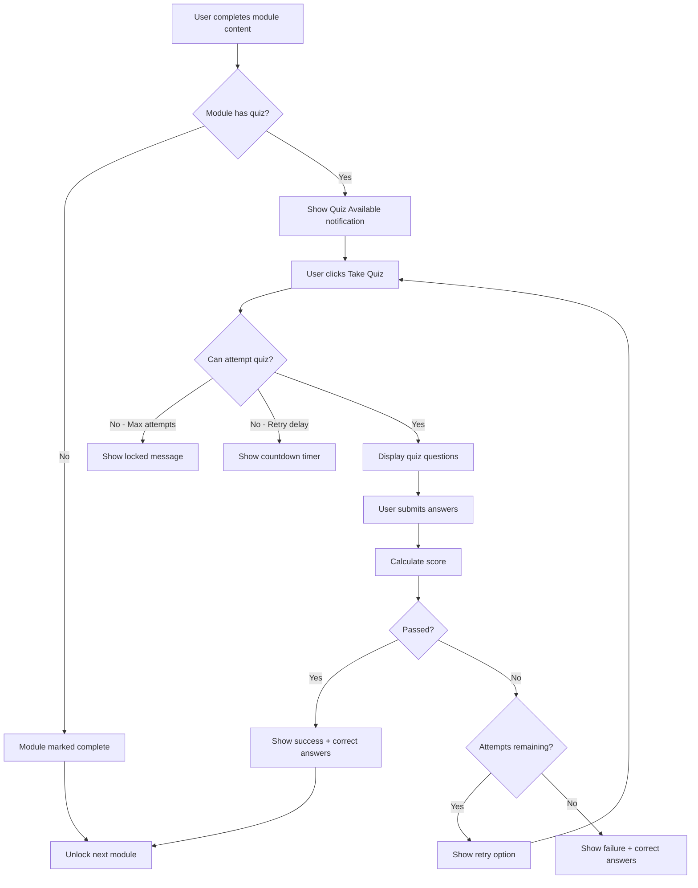

# Module Quiz Implementation Plan
## Coursera-like Quiz System for Online Course Modules

### Overview
This document outlines the implementation plan for adding a quiz system to online course modules, similar to Coursera's approach where users must complete a quiz after finishing each module before proceeding to the next one.

### Requirements Summary
Based on client requirements, all quiz settings will be **admin-configurable per quiz**:
- ✅ **Time Limit**: Admin configurable (optional, in minutes)
- ✅ **Max Attempts**: Admin configurable (1-10 attempts)
- ✅ **Pass Threshold**: Admin configurable (0-100%)
- ✅ **Retry Delay**: Admin configurable (optional, in hours)
- ✅ **Show Correct Answers**: Admin configurable (never/after pass/after max attempts/always)
- ✅ **Question Types**: Radio (single), Checkbox (multiple), Text (manual grading)
- ✅ **Quiz Creation**: Both inline during course creation AND separate management

---

## Current System Analysis

### Existing Components
1. **Quiz System** - Already exists with:
   - `quizzes` table with `course_id` and `course_online_id` support
   - `quiz_questions` table for questions (radio, checkbox, text types)
   - `quiz_attempts` table for tracking user attempts
   - `quiz_answers` table for storing user answers
   - Full admin CRUD for quizzes
   - User quiz taking interface

2. **Online Course Structure**:
   - `course_online` - Main course table
   - `course_modules` - Modules within courses
   - `module_content` - Content (videos/PDFs) within modules
   - `user_content_progress` - Tracks user progress on content
   - `course_online_assignments` - User enrollment in courses

3. **Module Unlock Logic**:
   - Currently based on completing all content in previous module
   - Located in [`CourseModule.isUnlockedForUser()`](app/Models/CourseModule.php:86)

### Gap Analysis
- **Missing**: Direct link between quizzes and modules (`module_id` in quizzes table)
- **Missing**: Module completion requiring quiz pass
- **Missing**: Admin UI to create quizzes per module during course creation
- **Missing**: User flow to take quiz after module content completion

---

## Implementation Plan

### Phase 1: Database Schema Updates

#### Migration: Add module_id to quizzes table
```php
// database/migrations/YYYY_MM_DD_add_module_id_to_quizzes_table.php

Schema::table('quizzes', function (Blueprint $table) {
    // Add module_id for module-level quizzes
    $table->unsignedBigInteger('module_id')->nullable()->after('course_online_id');
    
    // Add quiz settings for module quizzes
    $table->boolean('is_module_quiz')->default(false)->after('module_id');
    $table->boolean('required_to_proceed')->default(true)->after('is_module_quiz');
    $table->integer('max_attempts')->default(3)->after('required_to_proceed');
    $table->integer('retry_delay_hours')->default(0)->after('max_attempts');
    
    // NEW: Show correct answers configuration
    // Options: 'never', 'after_pass', 'after_max_attempts', 'always'
    $table->enum('show_correct_answers', ['never', 'after_pass', 'after_max_attempts', 'always'])
          ->default('after_pass')
          ->after('retry_delay_hours');
    
    // Index for performance
    $table->index('module_id', 'quizzes_module_id_index');
    
    // Foreign key
    $table->foreign('module_id')
          ->references('id')
          ->on('course_modules')
          ->onDelete('cascade');
});
```

#### Migration: Add quiz tracking to module progress
```php
// database/migrations/YYYY_MM_DD_add_quiz_fields_to_course_modules.php

Schema::table('course_modules', function (Blueprint $table) {
    $table->boolean('has_quiz')->default(false)->after('is_active');
    $table->boolean('quiz_required')->default(true)->after('has_quiz');
});
```

#### Migration: Create module_quiz_attempts table (optional, for detailed tracking)
```php
// database/migrations/YYYY_MM_DD_create_module_quiz_results_table.php

Schema::create('module_quiz_results', function (Blueprint $table) {
    $table->id();
    $table->foreignId('user_id')->constrained()->onDelete('cascade');
    $table->foreignId('module_id')->constrained('course_modules')->onDelete('cascade');
    $table->foreignId('quiz_id')->constrained()->onDelete('cascade');
    $table->foreignId('quiz_attempt_id')->constrained()->onDelete('cascade');
    $table->boolean('passed')->default(false);
    $table->decimal('score_percentage', 5, 2)->default(0);
    $table->timestamp('completed_at')->nullable();
    $table->timestamps();
    
    $table->unique(['user_id', 'module_id', 'quiz_attempt_id']);
    $table->index(['user_id', 'module_id', 'passed']);
});
```

---

### Phase 2: Backend Model Updates

#### Update Quiz Model
```php
// app/Models/Quiz.php - Add these relationships and methods

// Add to $fillable
'module_id',
'is_module_quiz',
'required_to_proceed',
'max_attempts',
'retry_delay_hours',

// Add relationship
public function module(): BelongsTo
{
    return $this->belongsTo(CourseModule::class, 'module_id');
}

// Add scope
public function scopeForModule($query, int $moduleId)
{
    return $query->where('module_id', $moduleId);
}

public function scopeModuleQuizzes($query)
{
    return $query->where('is_module_quiz', true);
}

// Check if user can attempt quiz
public function canUserAttempt(int $userId): array
{
    $attemptCount = $this->attempts()
        ->where('user_id', $userId)
        ->count();
    
    if ($attemptCount >= $this->max_attempts) {
        return [
            'can_attempt' => false,
            'reason' => 'Maximum attempts reached',
            'attempts_used' => $attemptCount,
            'max_attempts' => $this->max_attempts
        ];
    }
    
    // Check retry delay
    if ($this->retry_delay_hours > 0) {
        $lastAttempt = $this->attempts()
            ->where('user_id', $userId)
            ->latest()
            ->first();
            
        if ($lastAttempt) {
            $nextAttemptTime = $lastAttempt->created_at->addHours($this->retry_delay_hours);
            if (now()->lt($nextAttemptTime)) {
                return [
                    'can_attempt' => false,
                    'reason' => 'Retry delay not elapsed',
                    'next_attempt_at' => $nextAttemptTime,
                    'hours_remaining' => now()->diffInHours($nextAttemptTime)
                ];
            }
        }
    }
    
    return [
        'can_attempt' => true,
        'attempts_used' => $attemptCount,
        'attempts_remaining' => $this->max_attempts - $attemptCount
    ];
}
```

#### Update CourseModule Model
```php
// app/Models/CourseModule.php - Add these relationships and methods

// Add to $fillable
'has_quiz',
'quiz_required',

// Add relationship
public function quiz(): HasOne
{
    return $this->hasOne(Quiz::class, 'module_id');
}

public function quizResults(): HasMany
{
    return $this->hasMany(ModuleQuizResult::class, 'module_id');
}

// Check if user has passed module quiz
public function hasUserPassedQuiz(int $userId): bool
{
    if (!$this->has_quiz) {
        return true; // No quiz required
    }
    
    return $this->quizResults()
        ->where('user_id', $userId)
        ->where('passed', true)
        ->exists();
}

// Get user's quiz status for this module
public function getUserQuizStatus(int $userId): array
{
    if (!$this->has_quiz) {
        return [
            'has_quiz' => false,
            'status' => 'no_quiz',
            'message' => 'No quiz for this module'
        ];
    }
    
    $quiz = $this->quiz;
    if (!$quiz) {
        return [
            'has_quiz' => false,
            'status' => 'quiz_not_created',
            'message' => 'Quiz not yet created'
        ];
    }
    
    $passed = $this->hasUserPassedQuiz($userId);
    $canAttempt = $quiz->canUserAttempt($userId);
    
    $latestAttempt = QuizAttempt::where('quiz_id', $quiz->id)
        ->where('user_id', $userId)
        ->latest()
        ->first();
    
    return [
        'has_quiz' => true,
        'quiz_id' => $quiz->id,
        'quiz_title' => $quiz->title,
        'passed' => $passed,
        'required' => $this->quiz_required,
        'can_attempt' => $canAttempt['can_attempt'],
        'attempt_info' => $canAttempt,
        'latest_attempt' => $latestAttempt ? [
            'id' => $latestAttempt->id,
            'score' => $latestAttempt->total_score,
            'passed' => $latestAttempt->passed,
            'completed_at' => $latestAttempt->completed_at
        ] : null,
        'status' => $passed ? 'passed' : ($canAttempt['can_attempt'] ? 'available' : 'locked')
    ];
}

// UPDATED: isUnlockedForUser to include quiz requirement
public function isUnlockedForUser(int $userId): bool
{
    // First module is always unlocked
    if ($this->order_number === 1) {
        return true;
    }

    // Check if user is assigned to this course
    $assignment = CourseOnlineAssignment::where('course_online_id', $this->course_online_id)
        ->where('user_id', $userId)
        ->first();

    if (!$assignment) {
        return false;
    }

    // Get previous module
    $previousModule = CourseModule::where('course_online_id', $this->course_online_id)
        ->where('order_number', $this->order_number - 1)
        ->first();

    if (!$previousModule) {
        return true;
    }

    // Check if previous module content is completed
    $previousProgress = $previousModule->getUserProgress($userId);
    if (!$previousProgress['is_completed']) {
        return false;
    }

    // NEW: Check if previous module quiz is passed (if required)
    if ($previousModule->has_quiz && $previousModule->quiz_required) {
        if (!$previousModule->hasUserPassedQuiz($userId)) {
            return false;
        }
    }

    return true;
}
```

---

### Phase 3: Create ModuleQuizResult Model

```php
// app/Models/ModuleQuizResult.php

<?php

namespace App\Models;

use Illuminate\Database\Eloquent\Model;
use Illuminate\Database\Eloquent\Relations\BelongsTo;

class ModuleQuizResult extends Model
{
    protected $fillable = [
        'user_id',
        'module_id',
        'quiz_id',
        'quiz_attempt_id',
        'passed',
        'score_percentage',
        'completed_at',
    ];

    protected $casts = [
        'passed' => 'boolean',
        'score_percentage' => 'decimal:2',
        'completed_at' => 'datetime',
    ];

    public function user(): BelongsTo
    {
        return $this->belongsTo(User::class);
    }

    public function module(): BelongsTo
    {
        return $this->belongsTo(CourseModule::class, 'module_id');
    }

    public function quiz(): BelongsTo
    {
        return $this->belongsTo(Quiz::class);
    }

    public function attempt(): BelongsTo
    {
        return $this->belongsTo(QuizAttempt::class, 'quiz_attempt_id');
    }
}
```

---

### Phase 4: Backend Controllers

#### Create ModuleQuizController (Admin)
```php
// app/Http/Controllers/Admin/ModuleQuizController.php

<?php

namespace App\Http\Controllers\Admin;

use App\Http\Controllers\Controller;
use App\Models\CourseModule;
use App\Models\Quiz;
use App\Models\QuizQuestion;
use Illuminate\Http\Request;
use Illuminate\Support\Facades\DB;
use Inertia\Inertia;

class ModuleQuizController extends Controller
{
    /**
     * Show form to create quiz for a module
     */
    public function create(CourseModule $module)
    {
        $module->load('courseOnline');
        
        return Inertia::render('Admin/ModuleQuiz/Create', [
            'module' => [
                'id' => $module->id,
                'name' => $module->name,
                'order_number' => $module->order_number,
                'course' => [
                    'id' => $module->courseOnline->id,
                    'name' => $module->courseOnline->name,
                ]
            ]
        ]);
    }

    /**
     * Store quiz for a module
     */
    public function store(Request $request, CourseModule $module)
    {
        $validated = $request->validate([
            'title' => 'required|string|max:255',
            'description' => 'nullable|string',
            'pass_threshold' => 'required|numeric|min:0|max:100',
            'max_attempts' => 'required|integer|min:1|max:10',
            'retry_delay_hours' => 'nullable|integer|min:0|max:168',
            'time_limit_minutes' => 'nullable|integer|min:1|max:180',
            'required_to_proceed' => 'boolean',
            'questions' => 'required|array|min:1|max:50',
            'questions.*.question_text' => 'required|string',
            'questions.*.type' => 'required|in:radio,checkbox,text',
            'questions.*.points' => 'nullable|integer|min:0',
            'questions.*.options' => 'nullable|array',
            'questions.*.correct_answer' => 'nullable|array',
            'questions.*.correct_answer_explanation' => 'nullable|string',
        ]);

        DB::beginTransaction();
        try {
            // Create quiz linked to module
            $quiz = Quiz::create([
                'course_online_id' => $module->course_online_id,
                'module_id' => $module->id,
                'is_module_quiz' => true,
                'title' => $validated['title'],
                'description' => $validated['description'],
                'status' => 'published',
                'pass_threshold' => $validated['pass_threshold'],
                'max_attempts' => $validated['max_attempts'],
                'retry_delay_hours' => $validated['retry_delay_hours'] ?? 0,
                'time_limit_minutes' => $validated['time_limit_minutes'],
                'required_to_proceed' => $validated['required_to_proceed'] ?? true,
                'total_points' => 0,
            ]);

            // Create questions
            foreach ($validated['questions'] as $index => $questionData) {
                QuizQuestion::create([
                    'quiz_id' => $quiz->id,
                    'question_text' => $questionData['question_text'],
                    'type' => $questionData['type'],
                    'points' => $questionData['type'] !== 'text' ? ($questionData['points'] ?? 1) : 0,
                    'options' => $questionData['type'] !== 'text' 
                        ? array_values(array_filter($questionData['options'] ?? [], 'strlen')) 
                        : null,
                    'correct_answer' => $questionData['type'] !== 'text' 
                        ? array_values(array_filter($questionData['correct_answer'] ?? [], 'strlen')) 
                        : null,
                    'correct_answer_explanation' => $questionData['correct_answer_explanation'] ?? null,
                    'order' => $index + 1,
                ]);
            }

            // Calculate total points
            $totalPoints = $quiz->questions()->where('type', '!=', 'text')->sum('points');
            $quiz->update(['total_points' => $totalPoints]);

            // Update module to indicate it has a quiz
            $module->update([
                'has_quiz' => true,
                'quiz_required' => $validated['required_to_proceed'] ?? true,
            ]);

            DB::commit();

            return redirect()->route('admin.course-online.show', $module->course_online_id)
                ->with('success', 'Module quiz created successfully!');

        } catch (\Exception $e) {
            DB::rollBack();
            return back()->withErrors(['error' => 'Failed to create quiz: ' . $e->getMessage()]);
        }
    }

    /**
     * Edit module quiz
     */
    public function edit(CourseModule $module)
    {
        $quiz = $module->quiz;
        
        if (!$quiz) {
            return redirect()->route('admin.module-quiz.create', $module->id)
                ->with('info', 'No quiz exists for this module. Create one now.');
        }

        $quiz->load('questions');

        return Inertia::render('Admin/ModuleQuiz/Edit', [
            'module' => [
                'id' => $module->id,
                'name' => $module->name,
                'order_number' => $module->order_number,
                'course' => [
                    'id' => $module->courseOnline->id,
                    'name' => $module->courseOnline->name,
                ]
            ],
            'quiz' => [
                'id' => $quiz->id,
                'title' => $quiz->title,
                'description' => $quiz->description,
                'pass_threshold' => $quiz->pass_threshold,
                'max_attempts' => $quiz->max_attempts,
                'retry_delay_hours' => $quiz->retry_delay_hours,
                'time_limit_minutes' => $quiz->time_limit_minutes,
                'required_to_proceed' => $quiz->required_to_proceed,
                'questions' => $quiz->questions->map(fn($q) => [
                    'id' => $q->id,
                    'question_text' => $q->question_text,
                    'type' => $q->type,
                    'points' => $q->points,
                    'options' => $q->options,
                    'correct_answer' => $q->correct_answer,
                    'correct_answer_explanation' => $q->correct_answer_explanation,
                ])
            ]
        ]);
    }

    // ... update and destroy methods similar to QuizController
}
```

#### Create User ModuleQuizController
```php
// app/Http/Controllers/User/ModuleQuizController.php

<?php

namespace App\Http\Controllers\User;

use App\Http\Controllers\Controller;
use App\Models\CourseModule;
use App\Models\Quiz;
use App\Models\QuizAttempt;
use App\Models\QuizAnswer;
use App\Models\ModuleQuizResult;
use Illuminate\Http\Request;
use Illuminate\Support\Facades\DB;
use Inertia\Inertia;

class ModuleQuizController extends Controller
{
    /**
     * Show module quiz for user to take
     */
    public function show(CourseModule $module)
    {
        $userId = auth()->id();
        
        // Check if user has completed module content
        $progress = $module->getUserProgress($userId);
        if (!$progress['is_completed']) {
            return redirect()->back()
                ->with('error', 'Please complete all module content before taking the quiz.');
        }

        $quiz = $module->quiz;
        if (!$quiz) {
            return redirect()->back()
                ->with('error', 'No quiz available for this module.');
        }

        // Check if user can attempt
        $canAttempt = $quiz->canUserAttempt($userId);
        if (!$canAttempt['can_attempt']) {
            return redirect()->back()
                ->with('error', $canAttempt['reason']);
        }

        $quiz->load(['questions' => function($query) {
            $query->orderBy('order');
        }]);

        return Inertia::render('User/ModuleQuiz/Show', [
            'module' => [
                'id' => $module->id,
                'name' => $module->name,
                'course' => [
                    'id' => $module->courseOnline->id,
                    'name' => $module->courseOnline->name,
                ]
            ],
            'quiz' => [
                'id' => $quiz->id,
                'title' => $quiz->title,
                'description' => $quiz->description,
                'total_points' => $quiz->total_points,
                'pass_threshold' => $quiz->pass_threshold,
                'time_limit_minutes' => $quiz->time_limit_minutes,
                'questions' => $quiz->questions->map(fn($q) => [
                    'id' => $q->id,
                    'question_text' => $q->question_text,
                    'type' => $q->type,
                    'points' => $q->points,
                    'options' => $q->options,
                    // Don't send correct answers to frontend!
                ])
            ],
            'attemptInfo' => $canAttempt,
        ]);
    }

    /**
     * Submit quiz answers
     */
    public function submit(Request $request, CourseModule $module)
    {
        $userId = auth()->id();
        $quiz = $module->quiz;

        if (!$quiz) {
            return back()->withErrors(['error' => 'Quiz not found.']);
        }

        // Validate can attempt
        $canAttempt = $quiz->canUserAttempt($userId);
        if (!$canAttempt['can_attempt']) {
            return back()->withErrors(['error' => $canAttempt['reason']]);
        }

        $validated = $request->validate([
            'answers' => 'required|array',
            'answers.*.question_id' => 'required|exists:quiz_questions,id',
            'answers.*.answer' => 'nullable',
        ]);

        DB::beginTransaction();
        try {
            // Create attempt
            $attemptNumber = QuizAttempt::where('quiz_id', $quiz->id)
                ->where('user_id', $userId)
                ->count() + 1;

            $attempt = QuizAttempt::create([
                'quiz_id' => $quiz->id,
                'user_id' => $userId,
                'attempt_number' => $attemptNumber,
                'score' => 0,
                'total_score' => 0,
                'passed' => false,
            ]);

            // Process answers and calculate score
            $totalScore = 0;
            $questions = $quiz->questions()->get()->keyBy('id');

            foreach ($validated['answers'] as $answerData) {
                $question = $questions->get($answerData['question_id']);
                if (!$question) continue;

                $userAnswer = $answerData['answer'];
                $isCorrect = false;
                $pointsEarned = 0;

                if ($question->type !== 'text') {
                    // Auto-grade radio/checkbox
                    $correctAnswer = $question->correct_answer;
                    
                    if ($question->type === 'radio') {
                        $isCorrect = is_array($userAnswer) 
                            ? in_array($correctAnswer[0] ?? '', $userAnswer)
                            : $userAnswer === ($correctAnswer[0] ?? '');
                    } else {
                        // Checkbox - all correct answers must be selected
                        $userAnswerArray = is_array($userAnswer) ? $userAnswer : [$userAnswer];
                        $isCorrect = empty(array_diff($correctAnswer, $userAnswerArray)) 
                            && empty(array_diff($userAnswerArray, $correctAnswer));
                    }

                    if ($isCorrect) {
                        $pointsEarned = $question->points;
                        $totalScore += $pointsEarned;
                    }
                }

                QuizAnswer::create([
                    'quiz_attempt_id' => $attempt->id,
                    'quiz_question_id' => $question->id,
                    'answer' => is_array($userAnswer) ? json_encode($userAnswer) : $userAnswer,
                    'is_correct' => $isCorrect,
                    'points_earned' => $pointsEarned,
                ]);
            }

            // Calculate pass/fail
            $scorePercentage = $quiz->total_points > 0 
                ? ($totalScore / $quiz->total_points) * 100 
                : 0;
            $passed = $scorePercentage >= $quiz->pass_threshold;

            // Update attempt
            $attempt->update([
                'score' => $totalScore,
                'total_score' => $totalScore,
                'passed' => $passed,
                'completed_at' => now(),
            ]);

            // Create module quiz result
            ModuleQuizResult::create([
                'user_id' => $userId,
                'module_id' => $module->id,
                'quiz_id' => $quiz->id,
                'quiz_attempt_id' => $attempt->id,
                'passed' => $passed,
                'score_percentage' => $scorePercentage,
                'completed_at' => now(),
            ]);

            DB::commit();

            return redirect()->route('module-quiz.results', [
                'module' => $module->id,
                'attempt' => $attempt->id
            ]);

        } catch (\Exception $e) {
            DB::rollBack();
            return back()->withErrors(['error' => 'Failed to submit quiz: ' . $e->getMessage()]);
        }
    }

    /**
     * Show quiz results
     */
    public function results(CourseModule $module, QuizAttempt $attempt)
    {
        $userId = auth()->id();

        // Verify ownership
        if ($attempt->user_id !== $userId) {
            abort(403);
        }

        $attempt->load(['quiz.questions', 'answers']);
        $quiz = $attempt->quiz;

        // Determine if we should show correct answers
        $showCorrectAnswers = $attempt->passed || 
            ($quiz->max_attempts && $attempt->attempt_number >= $quiz->max_attempts);

        return Inertia::render('User/ModuleQuiz/Results', [
            'module' => [
                'id' => $module->id,
                'name' => $module->name,
                'course' => [
                    'id' => $module->courseOnline->id,
                    'name' => $module->courseOnline->name,
                ]
            ],
            'attempt' => [
                'id' => $attempt->id,
                'score' => $attempt->total_score,
                'total_points' => $quiz->total_points,
                'score_percentage' => $quiz->total_points > 0 
                    ? round(($attempt->total_score / $quiz->total_points) * 100, 1) 
                    : 0,
                'passed' => $attempt->passed,
                'pass_threshold' => $quiz->pass_threshold,
                'attempt_number' => $attempt->attempt_number,
                'completed_at' => $attempt->completed_at,
            ],
            'quiz' => [
                'id' => $quiz->id,
                'title' => $quiz->title,
                'max_attempts' => $quiz->max_attempts,
            ],
            'questions' => $quiz->questions->map(function($question) use ($attempt, $showCorrectAnswers) {
                $answer = $attempt->answers->firstWhere('quiz_question_id', $question->id);
                
                return [
                    'id' => $question->id,
                    'question_text' => $question->question_text,
                    'type' => $question->type,
                    'points' => $question->points,
                    'options' => $question->options,
                    'user_answer' => $answer ? json_decode($answer->answer, true) ?? $answer->answer : null,
                    'is_correct' => $answer?->is_correct,
                    'points_earned' => $answer?->points_earned ?? 0,
                    'correct_answer' => $showCorrectAnswers ? $question->correct_answer : null,
                    'explanation' => $showCorrectAnswers ? $question->correct_answer_explanation : null,
                ];
            }),
            'showCorrectAnswers' => $showCorrectAnswers,
            'canRetry' => $quiz->canUserAttempt($userId)['can_attempt'],
        ]);
    }
}
```

---

### Phase 5: Routes

```php
// routes/web.php - Add these routes

// Admin routes for module quizzes
Route::middleware(['auth', 'admin'])->prefix('admin')->name('admin.')->group(function () {
    Route::get('/modules/{module}/quiz/create', [ModuleQuizController::class, 'create'])
        ->name('module-quiz.create');
    Route::post('/modules/{module}/quiz', [ModuleQuizController::class, 'store'])
        ->name('module-quiz.store');
    Route::get('/modules/{module}/quiz/edit', [ModuleQuizController::class, 'edit'])
        ->name('module-quiz.edit');
    Route::put('/modules/{module}/quiz', [ModuleQuizController::class, 'update'])
        ->name('module-quiz.update');
    Route::delete('/modules/{module}/quiz', [ModuleQuizController::class, 'destroy'])
        ->name('module-quiz.destroy');
});

// User routes for taking module quizzes
Route::middleware(['auth'])->group(function () {
    Route::get('/modules/{module}/quiz', [UserModuleQuizController::class, 'show'])
        ->name('module-quiz.show');
    Route::post('/modules/{module}/quiz/submit', [UserModuleQuizController::class, 'submit'])
        ->name('module-quiz.submit');
    Route::get('/modules/{module}/quiz/results/{attempt}', [UserModuleQuizController::class, 'results'])
        ->name('module-quiz.results');
});
```

---

### Phase 6: Frontend Components

#### User Flow Diagram


#### Key Vue Components to Create

1. **`resources/js/pages/User/ModuleQuiz/Show.vue`** - Quiz taking interface
2. **`resources/js/pages/User/ModuleQuiz/Results.vue`** - Results display
3. **`resources/js/components/ModuleQuizCard.vue`** - Quiz status card for module view
4. **`resources/js/pages/Admin/ModuleQuiz/Create.vue`** - Admin quiz creation
5. **`resources/js/pages/Admin/ModuleQuiz/Edit.vue`** - Admin quiz editing

#### Update Existing Components

1. **`resources/js/pages/User/ContentViewer/Show.vue`**
   - Add quiz notification when module content is complete
   - Show "Take Quiz" button

2. **`resources/js/pages/User/CourseOnline/Show.vue`** (if exists)
   - Show quiz status per module
   - Indicate locked modules due to quiz requirement

3. **`resources/js/pages/Admin/CourseOnline/Create.vue`**
   - Add option to create quiz per module during course creation

---

### Phase 7: API Endpoints for Quiz Status

```php
// app/Http/Controllers/Api/ModuleQuizStatusController.php

public function getStatus(CourseModule $module)
{
    $userId = auth()->id();
    
    return response()->json([
        'success' => true,
        'quiz_status' => $module->getUserQuizStatus($userId),
        'module_progress' => $module->getUserProgress($userId),
    ]);
}
```

---

## User Experience Flow

### For Users:
1. User completes all content in a module (videos/PDFs)
2. System shows "Module Quiz Available" notification
3. User clicks "Take Quiz" button
4. Quiz interface displays with:
   - Timer (if time limit set)
   - Question navigation
   - Progress indicator
5. User submits quiz
6. Results page shows:
   - Score and pass/fail status
   - If passed: Congratulations + next module unlocked
   - If failed: Retry option (if attempts remaining) or correct answers (if max attempts reached)

### For Admins:
1. When creating/editing online course:
   - Option to add quiz per module
   - Quiz builder with question types (radio, checkbox, text)
   - Set pass threshold, max attempts, time limit
2. View quiz analytics per module
3. See user quiz attempts and scores

---

## Implementation Priority

### High Priority (Core Functionality):
1. Database migrations
2. Model updates (Quiz, CourseModule)
3. User quiz taking flow
4. Module unlock logic update

### Medium Priority (Admin Features):
5. Admin quiz creation per module
6. Quiz editing interface
7. Quiz analytics

### Lower Priority (Enhancements):
8. Email notifications for quiz results
9. Quiz retry delay feature
10. Detailed analytics dashboard

---

## Testing Checklist

- [ ] User can only access quiz after completing module content
- [ ] Quiz submission calculates score correctly
- [ ] Pass/fail determined by threshold
- [ ] Max attempts enforced
- [ ] Retry delay enforced (if configured)
- [ ] Next module unlocks only after quiz pass
- [ ] Correct answers shown appropriately
- [ ] Admin can create/edit/delete module quizzes
- [ ] Quiz questions display correctly
- [ ] Timer works (if time limit set)